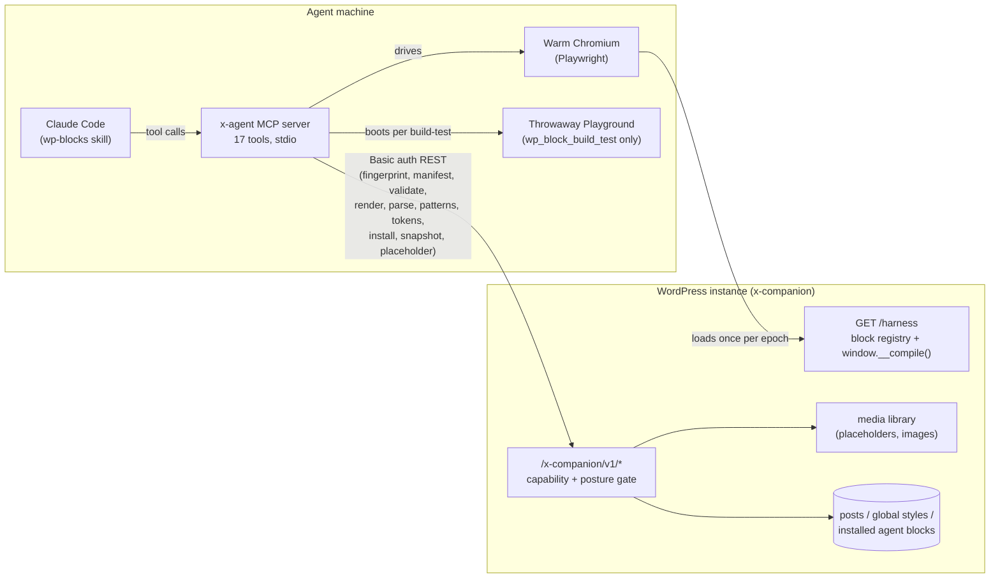
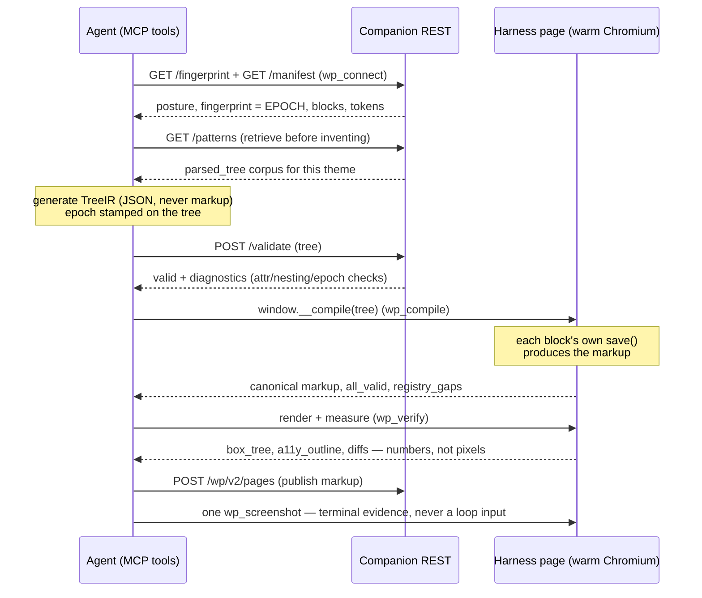
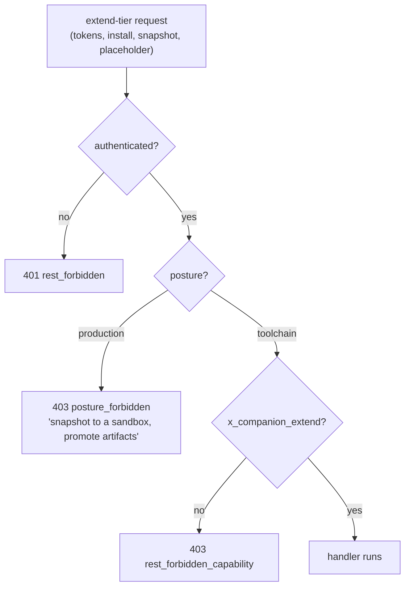

# How requests and processes flow between the agent and the WordPress instance

Two processes on the agent's machine — the **MCP server** (`x-agent`) and a **warm headless
Chromium** it drives — talk to one WordPress instance running **x-companion**. Everything
crosses the wire as authenticated REST; nothing on the instance ever calls out.



The **epoch** (the instance fingerprint) is the consistency mechanism: every tree the agent
sends carries it, and the companion refuses trees generated against a stale world
(`E_EPOCH_MISMATCH`). The agent's own actions — installing a block, writing tokens — move it.

## The build loop (R5): prompt → published page



## The vocabulary factory (R7 rung 3): a new block becomes vocabulary

```mermaid
sequenceDiagram
    participant A as Agent
    participant L as Local machine
    participant C as Companion REST

    A->>L: wp_block_scaffold → block.json + render.php + edit.js
    Note over A,L: agent implements render.php;<br/>edit.js is an inline-editable 1:1 mirror<br/>(RichText for text, MediaPlaceholder for images)
    A->>L: wp_block_build_test
    Note over L: wp-scripts build → throwaway Playground →<br/>register, render sample attrs, zip.<br/>THE safety gate — nothing ships without it
    L-->>A: built ✓ registered ✓ zip
    A->>C: POST /blocks/install (zip)
    C-->>A: NEW fingerprint — the epoch moved
    Note over A: every subsequent tree carries the new epoch;<br/>the block is now vocabulary like any core block
```

## Images before assets exist: placeholder + intent

```mermaid
sequenceDiagram
    participant A as Agent
    participant C as Companion REST
    participant G as Image-gen pass (later)

    A->>C: POST /placeholder {color: "accent-2"}
    C-->>A: {id, url} — idempotent 1×1 GIF on the palette
    Note over A: image node: url + width/aspectRatio/scale<br/>+ metadata.imageIntent = "what belongs here"<br/>Geometry is final; pixels are provisional
    A->>C: validate → compile → publish (intent rides in the block delimiter)
    G->>C: POST /parse (published content)
    C-->>G: tree with metadata.imageIntent leaves
    Note over G: generate/source each asset, upload,<br/>swap url/id on the node, recompile
    G->>C: publish updated markup — layout never moved
```

## The posture wall

Every mutating route sits behind the extend tier, and the extend tier is hard-disabled on a
`production` instance — before the request body is parsed, regardless of the caller's
capabilities:



The intended shape of work follows from the wall: **fabricate on a toolchain sandbox, verify
numerically, export with `wp_snapshot`, promote the artifact** — production receives results,
never the toolchain.
